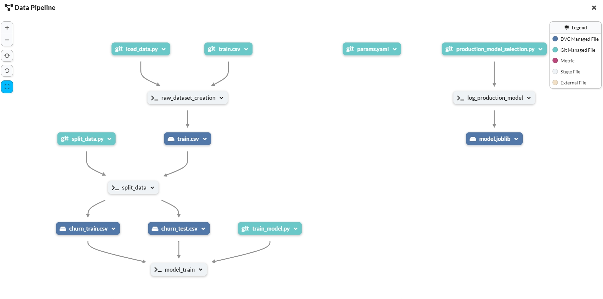

# End to End MLOps Project - Customer Churn Prediction
## Objective
Predict whether a customer will change telco provider using this kaggle [dataset](https://www.kaggle.com/c/customer-churn-prediction-2020/data?select=train.csv).

## Technologies
- [Cookiecutter](https://github.com/drivendataorg/cookiecutter-data-science): Data science project structure
- [Data version control (DVC)](https://github.com/iterative/dvc): Version control of the data assets and to make pipeline
- [Github](https://github.com/): For code version control
- [GitHub Actions](https://github.com/): To create the CI-CD pipeline
- [MLFlow](https://mlflow.org/): For model registry
- [Dagshub](https://dagshub.com/): MLFlow and DVC integration
- [Heroku](https://heroku.com/): To deploy the application
- [Flask](https://flask.palletsprojects.com/en/3.0.x/): To create a web app
- [EvidentlyAI](https://www.evidentlyai.com/): To evaluate and monitor ML models in production
- [Pytest](https://pypi.org/project/pytest/): To implement the unit tests
- [Flake8](https://pypi.org/project/flake8/): Code linting

## Environment Setup
### Cookiecutter
```shell
pip install cookiecutter-data-science
cookiecutter https://github.com/drivendata/cookiecutter-data-science -c v1
```
- project_name: mlops-project-customer-churn
- repo_name: mlops-project-customer-churn
- author_name: rohmats
- description: End to End MLOps Project - Customer Churn Prediction
- Select open_source_license: select MIT(option 1)
- s3_bucket /aws_profile[Optional]: just press enter
- Select python_interpreter:python3 ( Option 1)

### Conda Environment
```shell
conda create -n customer_churn python=3.9 -y 
conda activate customer_churn
```

### DVC
> Version control of the data assets and to make pipeline
```shell
pip install dvc 
dvc init 
dvc add data/external/train.csv
dvc repro
```
## MLflow Dagshub
```shell
pip install dagshub mlflow
```
[MLflow UI]([https://](https://dagshub.com/rohmats/mlops-project-customer-churn.mlflow))

## Unit testing
```shell
pytest -v 
```

## CI/CD Pipeline
To create a CI/CD pipeline for your project, you can use GitHub Actions. Here are the steps to set it up:

1. Create a `.github/workflows` directory in your repository.
2. Inside the `workflows` directory, create a YAML file (e.g., `ci-cd.yml`) to define your CI/CD workflow.
3. In the YAML file, define the workflow using the `on` keyword to specify the events that trigger the workflow (e.g., push to the `main` branch).
4. Use the `jobs` keyword to define the steps of your workflow. For example, you can have a job to build and test your code, and another job to deploy the application.
5. Configure the necessary environment variables and secrets for your workflow, such as API keys or deployment credentials.
6. Commit and push the YAML file to your repository.

With GitHub Actions, you can automate the build, test, and deployment processes of your project, ensuring that your application is always up-to-date and running smoothly.

## Linting
This project uses `flake8` for code linting

## [Final App Deployed on Heroku](https://mlops-sur-a44e15b513c2.herokuapp.com/)

## Data Pipeline


## Project Organization
------------
    ├── artifacts               <- MLflow artifacts
    │   └── 1
    │       └── 465969c77a7341d1b58ee4b044cbbcf8
    │           └── artifacts
    │               └── model
    ├── data                    <- Data directory
    │   ├── external            <- Data from third party sources
    │   ├── processed           <- The final, canonical data sets for modeling
    │   └── raw                 <- The original, immutable data dump
    ├── docs
    ├── models                  <- Trained and serialized models, model predictions, or model summaries
    ├── notebooks               <- Jupyter notebooks
    ├── references              <- Data dictionaries, manuals, and all other explanatory materials
    ├── reports                 <- Generated analysis as HTML, PDF, LaTeX, etc.
    │   └── figures
    ├── src                     <- Source code for use in this project
    │   ├── data                <- Scripts to download or generate data
    │   ├── features            <- Scripts to turn raw data into features for modeling
    │   ├── models              <- Scripts to train models and then use trained models to make predictions
    │   └── visualization       <- Scripts to create exploratory and results oriented visualizations
    ├── tests                   <- Unit tests
    └── webapp                  <- Web application
        ├── model_webapp_dir    <- Model web application directory
        ├── scripts             <- Scripts to run the web application
        ├── static              <- Static files
        │   └── css
        └── templates           <- HTML templates
--------

> <p><small>Project based on the <a target="_blank" href="https://drivendata.github.io/cookiecutter-data-science/">cookiecutter data science project template</a>. #cookiecutterdatascience</small></p>
